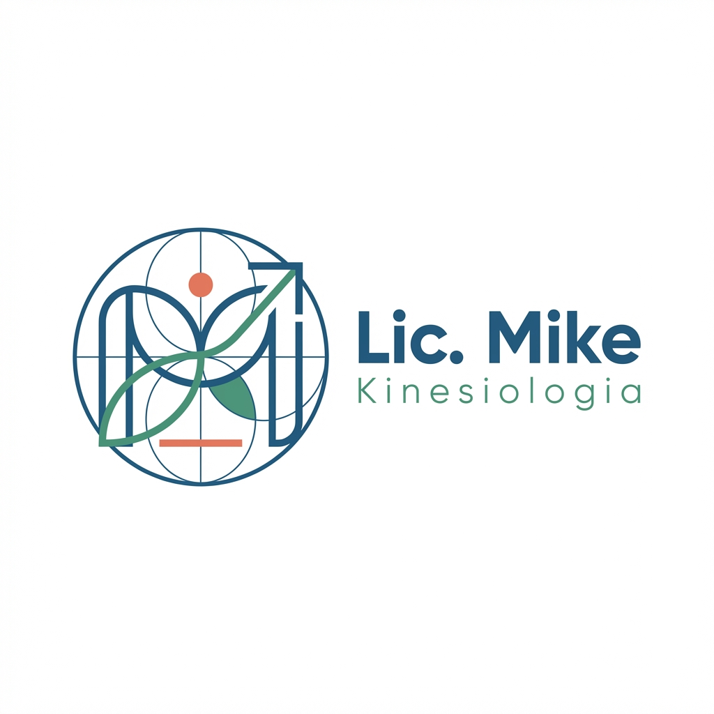

# PROMPT 01: LOGO & IDENTIDAD VISUAL (NIVEL PRO)

**Objetivo:** Crear la cara de una marca confiable, científica y moderna.
**Problema a evitar:** Que parezca un clip-art genérico de "hospital" (la típica cruz roja o columpna vertebral fea).
**Solución:** Geometría abstracta, Proporción Áurea, Minimalismo Suizo.

---

## 🎨 EL PROMPT (Para DALL-E 3 / Midjourney)

Copia este bloque exacto. Está en inglés técnico porque genera mejores resultados visuales.

```text
Design a world-class, minimalist logo for a Kinesiologist brand named "Lic. Mike".

**Visual Architecture:**
*   **Symbol:** An abstract, geometric construction representing "Alignment" and "Flow". Use Golden Ratio circles to construct the curves. Think "Swiss Design Style". ambiguous enough to imply movement/spine but NOT a literal bone illustration.
*   **Typography:** A robust, geometric Sans-Serif font (similar to 'Montserrat' or 'Gilroy'). The name "Lic. Mike" should be Bold/Heavy. The subtitle "Kinesiología" should be Light/Thin and tracked out (letter-spacing).
*   **Color Palette (Strict):**
    *   Primary: Deep Ocean Blue (#2C5F8D) - Communicates clinical trust.
    *   Secondary: Therapeutic Green (#4A9B7F) - Communicates growth/health.
    *   Accent: Vitality Coral (#E17055) - A small dot or line for energy.
*   **Background:** Pure White (#FFFFFF).

**Vibe:** High-end Medical Startup, not a local clinic. Reliable, Expensive, Scientific.
```

---

## 📝 GUÍA DE TEXTO (Para el Diseñador Final)

Si editas esto en Canva/Illustrator, esta es la jerarquía:

1.  **Logotipo (Texto Grande):** `Lic. Mike`
    - _Fuente:_ Montserrat ExtraBold o Open Sans Bold.
    - _Color:_ Azul (#2C5F8D).
2.  **Tagline (Texto Pequeño):** `KINESIOLOGÍA DEPORTIVA & INTEGRAL`
    - _Fuente:_ Montserrat Light (Espaciado 200).
    - _Color:_ Verde (#4A9B7F) o Gris Oscuro.

---

## 🖼️ ASSET GENERADO


