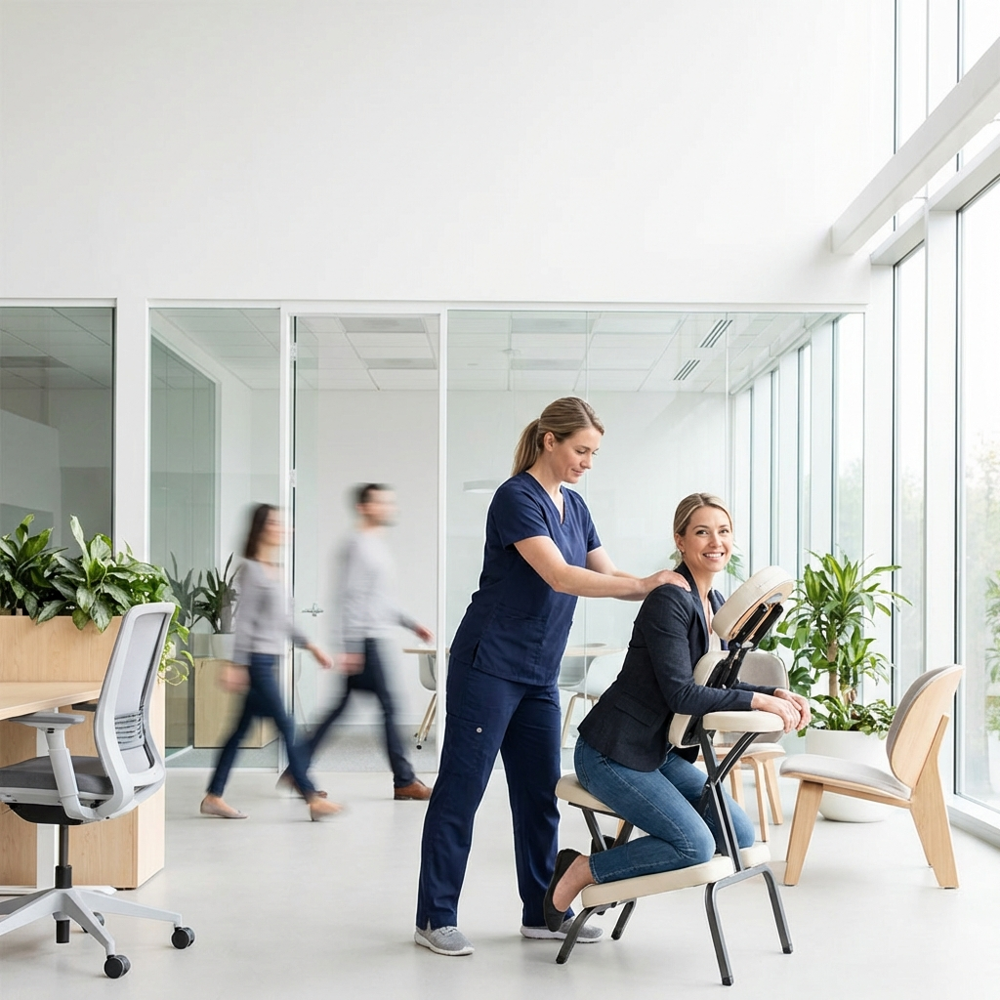

# PROMPT 08: FLYER CORPORATIVO (NIVEL B2B)

**Objetivo:** Convencer a un Gerente de RRHH de que esto es una inversión, no un gasto.
**Vibe:** Silicon Valley, Productividad, "Google Offices". NO "Call center triste".

---

## 🎨 EL PROMPT (Para Generar la Imagen de Fondo)

```text
High-end corporate lifestyle photography of an "Active Break" massage session in a modern tech office.

**Technical Specs:**
*   **Look:** Bright, airy, high-key lighting. "Apple Store" clean aesthetic.
*   **Lens:** 35mm f/2.8 (Contextual but focused).
*   **Blur:** Motion blur in the background (people walking) to show energy/activity.

**The Scene:**
*   **Action:** A physiotherapist (navy scrubs) giving a chair massage to a professional (business casual shirt) who looks energized/refreshed.
*   **Environment:** Glass walls, indoor plants, natural light, modern ergonomic furniture.
*   **Emotion:** Not sleepy/sleeping. The patient looks *ready to work*, recharged.

**Composition:**
*   Center-weighted or Right-weighted.
*   Top/Left area clear for corporate typography.
```

---

## 📝 BLUEPRINT DEL TEXTO (Copia esto en Canva)

**1. EL GANCHO (Título):**

> **EMPRESAS SALUDABLES,**
> **EQUIPOS PRODUCTIVOS.** 🚀

**2. EL PROBLEMA (Subtítulo pequeño):**

> _El 25% de las licencias son por dolor de espalda._

**3. LA SOLUCIÓN (Cuerpo):**

> **Pausas Activas & Masaje en Oficina**
> Llevamos el bienestar a tu empresa. Sin logística, sin perder tiempo.
>
> - 🔹 Reduce el estrés laboral.
> - 🔹 Mejora el clima organizacional.
> - 🔹 Aumenta el rendimiento.

**4. EL CIERRE (CTA B2B):**

> **SOLICITA UNA DEMO GRATUITA**
> _Lic. Mike Moyano - Bienestar Corporativo_

---

## 🖼️ ASSET GENERADO


