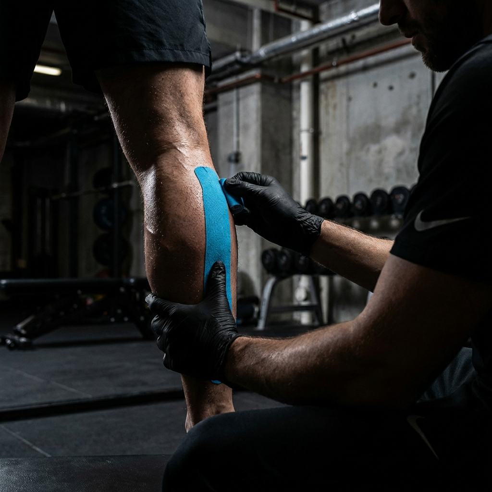

# PROMPT 09: FLYER GIMNASIOS (NIVEL NIKE AD)

**Objetivo:** Detener al gym rat que está scrolleando o saliendo de entrenar.
**Estilo:** Alto contraste, sudor, intensidad, "No Pain, No Gain" (pero con solución al pain).

---

## 🎨 EL PROMPT (Para Generar la Imagen de Fondo)

```text
Intense sports photography of a physiotherapy recovery session. "Nike Commercial" aesthetic.

**Technical Specs:**
*   **Lighting:** Dramatic side lighting (chiaroscuro). Shadows are deep blacks, highlights are sharp.
*   **Texture:** Visualize sweat, muscle definition, and the texture of the kinesio-tape.
*   **Color Grade:** Desaturated imagery with popping Blue/Cyan accents (the tape/medical gear).

**The Scene:**
*   **Action:** Close-up detail shot of hands applying blue kinesiology tape to a muscular shoulder or calf. Or deep tissue work on a trap muscle.
*   **Context:** Out of focus gym rack/weights in background. Dark industrial vibe.

**Composition:**
*   Diagonal lines for dynamism.
*   Solid dark area (shadow) suitable for white bold text overlay.
```

---

## 📝 BLUEPRINT DEL TEXTO (Copia esto en Canva)

**1. EL GANCHO (Título AGRESIVO):**

> **EL DOLOR ES TEMPORAL.**
> **LA LESIÓN NO.** 🛑

**2. LA OFERTA (Subtítulo):**

> **20% OFF** exclusivo para socios de [Nombre Gym].

**3. SERVICIOS (Lista rápida):**

> - ⚡ Descarga Muscular.
> - 🩹 Kinesio-Taping.
> - 🔧 Ajuste Biomecánico.

**4. EL CIERRE (CTA):**

> **RECUPERATE COMO UN PRO.**
> _Reserva al WhatsApp: 0991 763 400_

---

## 🖼️ ASSET GENERADO


