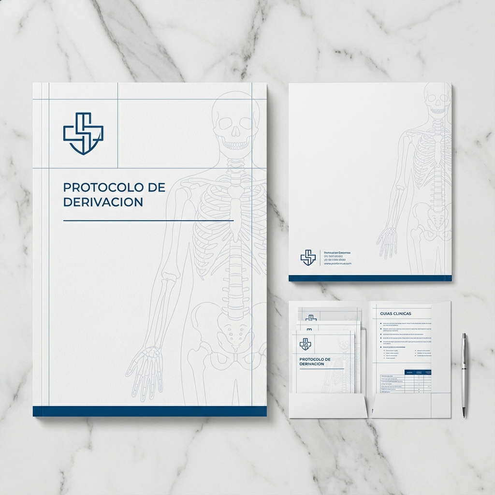

# PROMPT 10: MATERIAL MÉDICO (NIVEL PHARMA)

**Objetivo:** Que el traumatólogo piense "Este tipo es serio" antes de abrir la carpeta.
**Estilo:** Diseño Editorial Suizo. Minimalista. Mucho espacio en blanco.

---

## 🎨 EL PROMPT (Para Mockup de Diseño)

```text
Mockup of a high-end medical presentation folder (bi-fold brochure style) lying on a white marble table.

**Design Specs:**
*   **Style:** ultra-clean, "Swiss International Style". Grid-based layout.
*   **Palette:** Mostly white. Thin lines in Deep Blue (#2C5F8D).
*   **Graphics:** A very subtle, thin-line vector illustration of human anatomy (skeletal system) faded in the background (5% opacity).

**Text Simulation (what the AI should try to render on the paper):**
*   Header: "PROTOCOLO DE DERIVACIÓN" (Sans serif, uppercase, tracked out).
*   Logo area: A clean geometric logo mark.
*   Footer: A solid blue bar at the bottom.

**Lighting:**
*   Soft, diffuse showroom lighting. Soft shadows. Professional stationery vibe.
```

---

## 📝 TEXTO PARA LA CARPETA REAL (Imprenta)

**PORTADA:**

> **LIC. MIKE MOYANO**
> _Kinesiología & Fisioterapia_
>
> **PROTOCOLO DE ATENCIÓN KINESIOLÓGICA**
> Especialidad en Rehabilitación Traumatológica y Deportiva.

**CONTRATAPA (Datos de contacto):**

> 📍 Atención domiciliaria y Consultorio en [Dirección]
> 📞 +595 991 763 400
> 📧 contacto@mikemoyano.com
>
> _"Trabajando en equipo con el médico para la recuperación total del paciente."_

---

## 🖼️ ASSET GENERADO


