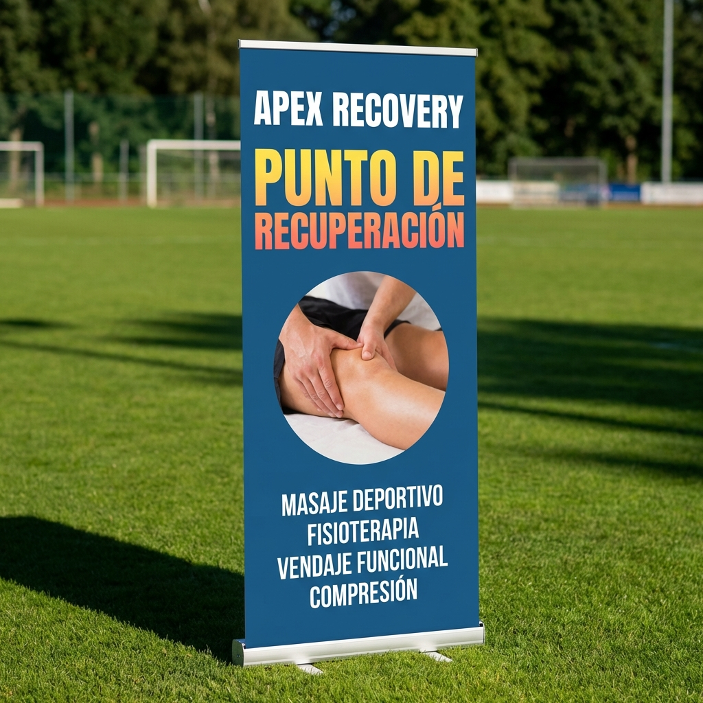

# PROMPT 11: BANNER EVENTOS (NIVEL FESTIVAL)

**Objetivo:** Ser visto desde 50 metros de distancia en una cancha de fútbol bajo el sol.
**Clave:** Contraste extremo. Letras GIGANTES.

---

## 🎨 EL PROMPT (Para Mockup Roll-Up)

```text
Product mockup of a vertical Roll-Up Banner standing on green grass (outdoor sports field context).

**Design Specs:**
*   **Background Color:** Deep Ocean Blue (#2C5F8D) - solid. (To contrast against Green grass and White sky/tents).
*   **Typography:** Massive, Bold, White Sans-Serif font. Condensed font style (tall letters) to maximize size.
*   **Imagery:** A "Cut-out" circle in the middle showing a photo of a leg getting massaged.

**Visual Hierarchy (Top to Bottom):**
1.  LOGO (White)
2.  "PUNTO DE RECUPERACIÓN" (Huge Yellow/Coral text)
3.  PHOTO BUBBLE
4.  LIST OF SERVICES (White bullets)
5.  WHATSAPP ICON (Huge)

**Lighting:**
*   Direct sunlight, sharp shadows on the grass. Realistic outdoor render.
```

---

## 📝 TEXTO PARA EL BANNER (Imprenta)

**CABECERA:**

> **LIC. MIKE**
> _(Logo Vectorial Blanco)_

**GANCHO (GIGANTE, COLOR CORAL O AMARILLO):**

> **PUNTO DE**
> **RECUPERACIÓN** 🚑

**CUERPO (Súper legible):**

> - ⚡ MASAJE EXPRESS
> - ❄️ HIELO & VENDAJE
> - 🩹 ESTIRAMIENTOS

**PIE:**

> 📲 **0991 763 400**
> _(Icono IG) @LicMikeMoyano_

---

## 🖼️ ASSET GENERADO


